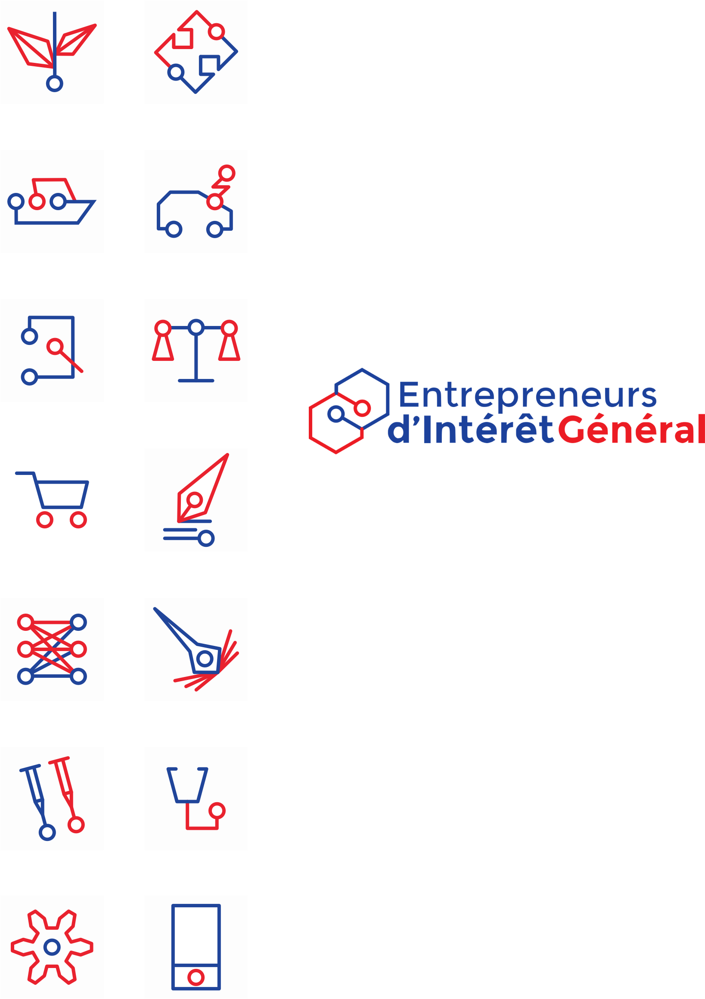

# Design System - EIG

Ce dépôt à un double objectif :
* Définir ce qu'est un design system 
* Construire et mettre en application le deisgn system au sein du programme EIG

## Sommaire

* [Définition Design System](#définition-design-system)
	* [Enjeux](#enjeux) 
	* [Principes](#principes)
	* [Ressources Design System](#ressources-design-system)
		* [Exemples de design system](#exemples-de-design-system)
		* [Articles design system](#articles-design-system)
* [Design System EIG](#design-system-eig)
	* [Contexte de l'Etat](#contexte-de-l-etat)
	* [Visuel du programme EIG](#visuel-du-programme-eig)
	* [Exemple avec la liste des logos EIG 2019](#exemple-avec-la-liste-des-logos-eig-2019)
* [Maintenance de ce dépôt](#maintenance-de-ce-dépôt)
* [Contributions sur ce dépôt](#contributions-sur-ce-dépôt)
* [Licence](#licence)

## Définition Design System

Un **design system** (ou une conception de *système*) est un processus de définition de l'architecture, 
des modules, des interfaces et des *données* permettant à un système de satisfaire à des *exigences* spécifiques. La conception de système pourrait être considérée comme l'application de la *théorie des systèmes* au *développement de produits*.

> *"Un système de conception n’est pas un projet. C’est un produit servant des produits." Nathan Curtis*

Dans l'espace numérique un **design system** est un référentiel UX et UI que les éditeurs et les parties prenantes utilisent pour designer et développer des produits ou des services. Quel que soit **l'objet** (application, plateforme de service, siteweb…), **le secteur** (BtoC, BtoB, BtoE…) et **les supports** (web, mobile, système embarqué…). 

Un **design system** agit sur 3 composantes du design : le visuel, les usages et le langage.
* **Visuel**: les éléments visuels permettent de faire apparaître les valeurs, le positionnement et la raison d’être et sont la base de la perception des utilisateurs.
* **Usages** : les usages doivent être les plus simples et intuitifs possibles pour les utilisateurs et correspondent aux comportements des utilisateurs en ligne. 
* **Langage** : le langage est la manière dont une organisation s’adresse à ses utilisateurs afin de les accompagner dans leurs prises de décisions et leurs actions.

### Enjeux

Le Design System intervient pour répondre aux nouveaux enjeux du design :
 
> * **Image** : garder une cohérence d’image de marque entre l’ensemble de leurs outils numériques mais aussi de leurs autres supports d’expression (*print*, *corporate*, *retail*…).
> * **Cohérence** : offrir aux utilisateurs une cohérence dans les usages, les éléments graphiques et la manière de communiquer sur leurs différents produits numériques.
> * **Optimisation** : optimiser le temps de design, de développement et ainsi optimiser leur budget et leur *time to market*.
> * **Organisation** : permettre à l’ensemble des intervenants d’avoir un point central qui fera référence et apportera la cohérence souhaitée.

### Principes

Voici les 5 grands principes de la démarche de Design System :

> * **Vivant** : contrairement à une charte graphique, le Design System est un produit vivant qui évolue et s’améliore avec le temps en fonction des nouveaux besoins, des nouveaux usages et de l’identité de l’entreprise.
> * **Agnostique** : c’est le design qui doit diriger le développement et pas l’inverse. Un Design System doit donc être pensé indépendamment d’une technologie mais doit pouvoir être compatible avec les technologies des interfaces web.
> * **Atomic** : le Design System repose sur le principe de l’Atomic Design. Là encore, contrairement aux chartes numériques traditionnelles, un Design System n'est pas conçu par pages mais par composants. Une des pierres angulaires de la conception d’un Design System est l’identification de l’ensemble des composants et motifs de l’écosystème numérique de l’entreprise.
> * **Universel** : un Design System doit pouvoir reprendre un ensemble de standards universels qui permettra aux utilisateurs de ne pas avoir à acquérir de nouvelles habitudes. Il doit également répondre à des logiques d’internationalisation, que ce soit sur les usages ou le langage.
> * **Inclusive** : le Design System doit s'adresser à tous, indépendamment du contexte d’utilisation et du niveau de maturité des utilisateurs avec le numérique. Il doit intégrer les grandes règles d’utilisabilité et d’accessibilité.

### Ressources Design System

#### Exemples de design system 

* https://polaris.shopify.com/
* **http://styleguides.io/**
* https://styleguide.mailchimp.com/
* https://principles.design/
* https://www.invisionapp.com/inside-design/ux-team-core-values/
* http://www.bbc.co.uk/gel/guidelines/how-to-use-reactions-in-your-content
* https://atlassian.design/
* https://www.ibm.com/design/language/
* https://www.lightningdesignsystem.com/
* https://design-system.futurelearn.com/
* https://dev.fitbit.com/guides/design-guidelines/
* https://styleguide.pivotal.io/

#### Articles design system

> * [Systems design](https://en.wikipedia.org/wiki/Systems_design) par Wikipédia 
> * [Tout savoir sur le Design System](https://newflux.fr/2017/10/23/savoir-design-system/) par Simon Gomez
> * [Tout savoir sur les systèmes de design System](https://medium.com/@audreyhacq/tout-savoir-sur-les-syst%C3%A8mes-de-design-1b6400c9a1b3) par Audrey Hacq
> * [Qu'est-ce qu'un design system](https://www.usabilis.com/design-system/) par Usabilis

## Design System EIG

### Contexte de l'Etat

La [Charte Internet de l'Etat](http://references.modernisation.gouv.fr/charte-internet-de-letat
) a été publiée en Février 2012. Elle constitue un guide pratique et opérationnel dans le but de garantir une amélioration de la qualité générale de l'Internet de l'État. Cette Charte s'appuie sur la [Charte Ergonomique des sites internet publics](http://references.modernisation.gouv.fr/sites/default/files/Charte_ergonomique_v2.0_2.pdf)datant de 2008, qui définit un ensemble de règles ergonomiques communes aux interfaces des sites Internet publics. 

D'autres références et ressources comme https://template.data.gouv.fr/ (cf. [GitHub](http://github.com/etalab/template.data.gouv.fr)) ou [PIDILA](https://pidila.gitlab.io/) ont également un intérêt pour le programme Entrepreneur d'Intérêt Général.

### Visuel du programme EIG

Le design system pour le programme EIG évolue en fonction des besoins. 

Concernant le visuel du programme nous avons les élements suivants :

* L'ensemble des [**logos**](Visuel/Logo/) des défis, du programme EIG, et des adminisitrations de l'écoystème
	* [Logos des administrations](Visuel/Logo/LogoAdministrations)
	* [Logos **EIG 2019**](Visuel/Logo/LogoEIG2019) : au [format SVG](Visuel/Logo/LogoEIG2019.svg), au [format PNG](Visuel/Logo/LogoEIG2019.png)
	* [Logos **EIG 2018**](Visuel/Logo/LogoEIG2019) : au [format SVG](Visuel/Logo/LogoEIG2018.svg), au [format PNG](Visuel/Logo/LogoEIG2018.png)
* Des [**ressources de communication**](Visuel/Ressources)
	* Concernant la communication du programme EIG : 
		* Des [conseils sur la présentation du programme EIG](https://github.com/entrepreneur-interet-general/eig-link/blob/master/communication.md#pr%C3%A9senter-le-programme-eig)
		* Une [petite présentation du programme EIG](https://github.com/entrepreneur-interet-general/design-system/blob/master/Visuel/Ressources/ComProgramme/Pr%C3%A9sentationEIG.pdf)
	* Concernant votre propre communication
		* Des **modèles/templates de présentation/slides** (aux formats [ODP (opensource)](/Visuel/Ressources/ComTemplate/TemplateEIG.odp), [PPT](/Visuel/Ressources/ComTemplate/TemplateEIG.pptx), [KEY](/Visuel/Ressources/ComTemplate/PrésentationEIG.key), [GoogleSlide](https://docs.google.com/presentation/d/1t-XPts11-v4aBxwbiaOyEyyFkgVD5i7IGTZBUpFhZfU/edit?usp=sharing))
		* Des [sites web de la promotion EIG 2018](https://github.com/entrepreneur-interet-general/eig-link/blob/master/contributions.md#sites-web-publi%C3%A9s-pendant-les-d%C3%A9fis-eig-2018)
* Des [**illustration unDraw**](Visuel/Illustration/unDraw) : Ce sont des exemples d'illustrations de personnes provenant du site [unDraw](https://undraw.co/illustrations) au couleur du programme EIG
* Des [**polices/typos**](Visuel/Police/) utilisées sur le site web EIG 

### Exemple avec la liste des logos EIG 2019

## Maintenance de ce dépôt

Ce dépôt est à destination du programme Entrepreneur d'Intérêt Général.

Ce projet est maintenu par Jean-Baptiste Le Dévéhat, [EIG Link 2019](https://github.com/entrepreneur-interet-general/eig-link).

Pour toute question : `jean-baptiste.le-devehat@data.gouv.fr`

## Contributions sur ce dépôt

Ce dépôt est ouvert aux contributions - vous pouvez :
- poser une question sur le contenu en ouvrant une issue ;
- *forker* le dépôt et envoyer des *pull request* avec des propositions d'amélioration ;
- si vous êtes EIG, demander à être ajouté comme collaborateur pour pouvoir contribuer directement au dépôt.

Merci !

## Licence

2018-2019 Direction interministérielle du numérique et du système d'information et de communication de l'État.

2018-2019 Les contributeurs accessibles via l'historique du dépôt.

Les contenus accessibles dans ce dépôt sont placés sous [Licence Ouverte 2.0](LICENSE.md) dans ce répertoire. Vous êtes libre de réutiliser les contenus de ce dépôt sous les conditions précisées dans cette licence.

